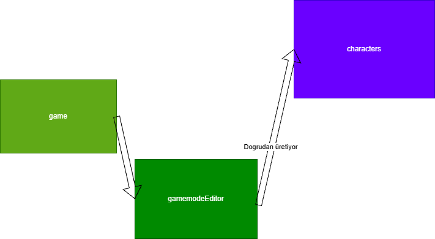
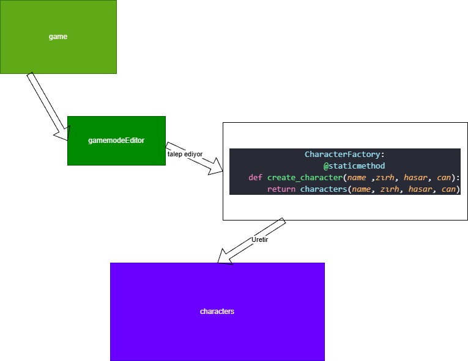
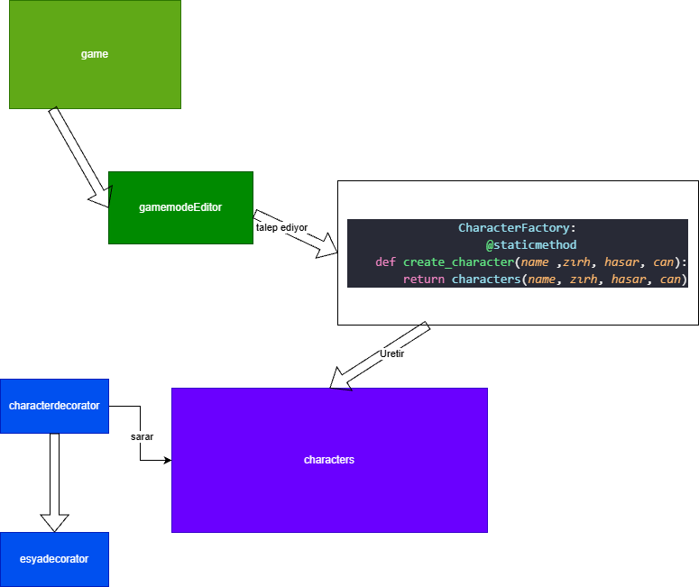
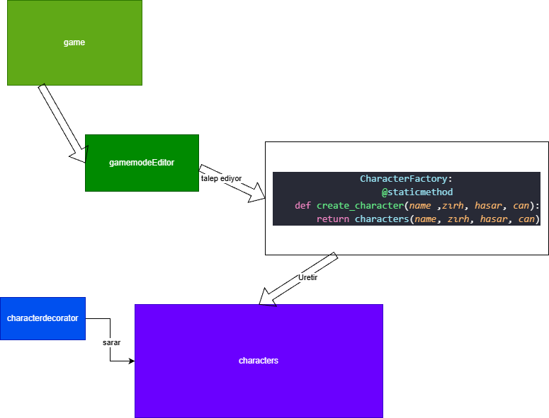
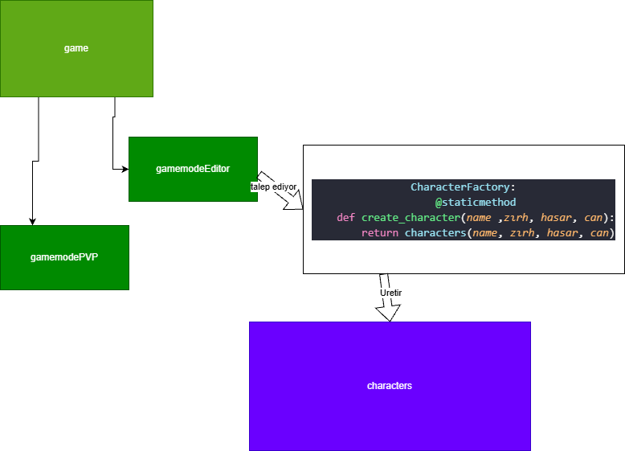

 Nerede?
Bu örüntü projedeki oyun nesnelerinin ve karakterlerin üretim süreclerini soyutlamak adına projenin ana dizininde yer alan CharacterFactory ve EsyaFactory sınıflarında uygulanmıstır.

CharacterFactory.create_character(...) metodu, characters sınıfından yeni karakter nesneleri üretir.

EsyaFactory.create_esya(...) metodu, Esyalar sınıfından oyun içi eşyalar üretir.

İstemci kod olan game sınıfı (veya oyun başlangıcı), new mantığıyla doğrudan somut sınıfları çağırmak yerine nesneleri bu fabrikalardan ister.

 Neden?
Sorunum:: Örüntü uygulanmadan önce, eğer karakterlerin veya eşyaların nasıl oluşturulacağı, hangi varsayılan değerleri alacağı bilgisi doğrudan ana program akışına (game sınıfına veya oyunun yazıldığı yere) yazılsaydı, kodda sıkı bağımlılık olusacaktı. İleride yeni bir karakter türü eklemek veya nesne üretim mantığını değiştirmek istediğimizde, oyunun akıs kodunu da değistirmek zorunda kalacaktık (ki bu da Open/Closed Prensibi ihlali olmus olurdu).

Seçim Nedeni: Nesne üretme sorumluluğunu tamamen istemci sınıftan koparmak, üretimi tek bir merkezde yani fabrikada toplamak ve gelecekte oyuna yeni nesne tipleri eklendiğimde ana oyun motorunun koduna dokunmadan sistemi genişletebilmek için bu örüntüyü seçtim.

 Ne Kazandınız?
Gevşek Bağlılık (Esneklik): Oyun motoru (game) ve editor modları nesnelerin tam olarak arka planda nasıl inşa edildiğinin detaylarını bilmek zorunda kalmiyor. Sadece fabrikaya emir verip ve nesneyi teslim aliyor.

Kolay Genişletilebilirlik: İleride yeni bir karakter tipi veya eşya özelliği eklendiğimde değişiklik yapılacak tek yer ilgili Factory sınıfı olacak. Mevcut çalışan menu ve editor kodları bu değişiklikten etkilenmiyor.

Kod Tekrarının Önlenmesi: Oyunun başlangıcında veya gamemodeEditor içinde dinamik karakter eklenirken, karakter oluşturma mantığı tek bir çatı altında standartlastırılmıs oluyor.

Bakim: tek yerde toplandığı için bakım yapılması kolaylaşmış olacak.

Önceki bağımlı ve sıkı yapı:::
 

Sonraki düzeltilmiş ve daha esnek yapı:::

FAZ 2 için::: 
İKİ farklı decorator öruntusu kullandım
`characterdecorator` ve `esyadecorator` sınıflarında uygulandı.

secme sebebim:  Editörden eklenecek olan dinamik eşya bonuslarının (Can İksiri, Demir tuy vb.) karakterlerin statlarına sadece o vurus anında (gecici olarak) etki etmesi savaş bittiğinde karakter nesnesinin orijinal haline sadık kalması için seçtım

bana yararı : Her yeni eşya için koda elle yeni bir alt sınıf yazma zorunluluğunu (Sınıf Patlamasını) engellemıs oldu. + olarak can ve zırh formullerını bırbırıne bagladıgımda da bunu cok daha rahat çevirmiş olacagım.

guncel olarak esyadecorator classımı sılıp bunun yerıne command oruntusu kullanma kararı aldım. cunku decorator oruntum malesef tum esyalara aynı sarma ıslemlerını yapıyordu ve tek tek ayrı fonksıyonlar kurmam gereklıydı kı bu hıc dınamık olmayacktı. bu yuzden ABC command kullandıgım 'etkilesim' adında bır kod yazdım. ki bu isimizi cok daha esnek ve dınamıklıge uygun hale getırebıldı.

EVET kodumu hemen hemen bıtırmısım gıbı hıssedıyorum sahsen. bır cok farklı pattern kullandım ve solide uygun oldugunu dusunuyorum. ve tabi hala ai log phase3.md asamasını yapmadım. ama şimdi patternlerimden tekrar bahsederek sizi güncelleyecegım ve patterns.md dosyamızı tamamlamış olacagım.

ilk olarak Observer (Gozlemci) öruntusu kullandım gozlemci, savasspikeri sınıflarında ve savaskarakteri içerisindeki spikerekle metodunda.	Savaş karakterinin canı azaldığında veya hasar aldıgında spikere otomatik haber ucmus oluyor (ki bunu spiker.guncelle methoduyla yapıyorum)
ikinci kullandıgım pattern Factory Method (Fabrika).characterfactory ve esyafactory sınıflarında kullandım ki hemen hemen en basından beri kullanıyorum desem yeridir.	characters ve Esyalar nesnelerini doğrudan newlemek yerine uretim sorumluluğunu bu fabrikalara verıp olusturmus oluyorum.
ucuncu olarak Strategy (Strateji) örüntüsü kullandım diyebilirim.	saldırıstratejisi, normalsaldiri, kritiksaldiri, cancalmasaldiri sınıflarında zaten kullandım ama menuyu normal sekılde gamemodeEditor ve gamemodePVP olarak ayırırken de aslında bır stratejı oruntusu kurmus oldum.	Karakterlerin savaş esnasında yapacağı saldırı davranışlarını dinamik olarak değiştirmeyi sağlarken gamemodePVP ve gamemodeEditorde ise rahatça birbirleri arasında geçiş yapabilmelerini sağlıyor.
ve dördüncü olarak Registry (Kayıt Deposu) kullanımım var.	stratejideposu sınıfında bunu göruyoruz .Stratejileri bir sözlükte (depo seklinde) toplayıp isimle çağrılabilir hale getirmıs oluyorum. Bu mimari Strategy pattern'ı destekleyen harika bir yardımcı oruntu gorevı goruyor.
Ve son olarak uzucu bır sekılde characterdecoratore veda ediyoruz. Aslında kesınlıkle işime yarayacagını dusunerek yazmıstım ama kenarda dururken onun gorevını zaten yapan bambaska kodlar devreye gırdı desem yeridir. karakter sec methodumda zaten gerekenı yapıyorum ve characterfactoryde de zaten uretımımı tamamıyoum. ustunu sarmak gıbı bır kaygım otomatıkmen ortadan kalkmıs oluyor. bu yuzden decoratoru kaldırdım ve hayalet gıbı kodumun ıcınde kalmasını ıstemedım.
